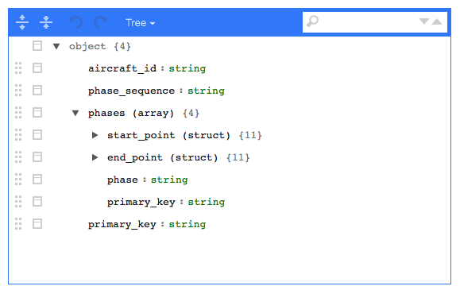

[](https://travis-ci.org/mitre/sparklyr.nested)
[](https://cran.r-project.org/package=sparklyr.nested)


A package to extend the capabilities available in the `sparklyr` package
with support for working with nested data.

## Installation & Documentation

To install:

``` r
devtools::install_github("mitre/sparklyr.nested")
```

Note that per the `sparklyr` installation instructions, you will need to
install Spark if you have not already done so or are not using a cluster
where it is already installed.

Full documentation is available here:
<https://mitre.github.io/sparklyr.nested/>

## Nested Operations

The `sparklyr` package makes working with Spark in R easy. The goal of
this package is to extend `sparklyr` so that working with nested data is
easy. The flagship functions are `sdf_select`, `sdf_explode`,
`sdf_unnest`, and `sfd_schema_viewer`.

### Schema Viewer

Suppose I have data about aircraft phase of flight (e.g., climb, cruise,
descent). The data is somewhat complex, storing radar data points marked
as the start and end points of a given phase. Furthermore, the data is
structured such that for a given flight, there are several phases
(disjoint in time) in a nested array.

This is a data set that is not very natural for more R use cases (though
the `tidyr` package helps close this gap) but is fairly typical for
Hadoop storage (e.g., using Avro or Parquet). The schema viewer (coupled
with a json schema getter `sdf_schema_json`) makes understanding the
structure of the data simple.

Suppose that `spark_data` is a Spark data frame. The structure may be
understood by explanding/collapsing the schema via

``` r
spark_data %>%
  sdf_schema_viewer()
```



It is also handy to use the schema viewer to quickly inspect what a
pipeline of operations is going to return. This enables you to
anticipate the structure of the output you are going to get (and make
sure the operations are valid with respect to schema modification)
without doing any actual computation on your data. For example:

``` r
spark_data %>%
  sdf_unnest(phases) %>%
  select(aircraft_id, start_point) %>%
  sdf_schema_viewer()
```

### Nested Select

The `sdf_select` function makes it possible to select nested elements.
For example, given the schema displayed above, we may be interested in
only the phase start point; and within that, only the time and altitude
fields. Grabbing these elements is not possible with a simple `select`,
but can be done via:

``` r
spark_data %>%
  sdf_select(aircraft_id, time=phases.start_point.time, altitude=phases.start_point.altitude)
```

In java dots are not valid characters in a field name so the
dot-operator is handled. However, since the dollar sign is typically
used for this purpose in R, that is supported as well. The following
will trigger the same operation as the above:

``` r
spark_data %>%
  sdf_select(aircraft_id, time=phases$start_point$time, altitude=phases$start_point$altitude)
```

What if you want to keep all top level fields, except phases, from which
you still want to start point time and altitude? This can be
accomplished via:

``` r
spark_data %>%
  sdf_select(aircraft_id, phase_sequence, primary_key, 
             time=phases$start_point$time, altitude=phases$start_point$altitude)
```

In this particular example things are not so bad. But imagine a case
where you have a wide data set. Listing out each top level field would
quickly become cumbersome. To ease this pain, the `dplyr` selection
helpers are supported, so the above operation may be accomplished using:

``` r
spark_data %>%
  sdf_select(everything(), time=phases$start_point$time, altitude=phases$start_point$altitude)
```

### Explode

The example above would work, but would return something of a mess. The
`time` and `altitude` fields would contain vectors of time and altitude
values (respectively) for each row-wise element. Thus for a single
`aircraft_id` you would have N values in the corresponding `time` and
`altitude` fields. The explode functionality will flatten the data in
the sense that it will replicate the top level record once for each
element in a nested array along which you are exploding. It will *not*
change the schema beyond transforming arrays to structures.

The above example could be repeated like so to get something more
typical for R where there is a single value per field per “row”
(record). In this case the `aircraft_id` values would be replicated N
times instead of having vectors in the `time`/`altitude` fields.

``` r
spark_data %>%
  sdf_explode(phases) %>%
  sdf_select(aircraft_id, time=phases$start_point$time, altitude=phases$start_point$altitude)
```

### Unnest

Unnesting here works essentially the same way as in the `tidyr` package.
It is necessary here because `tidyr` functions cannot be called directly
on spark data frames. An unnest operation is a combination of an explode
with a corresponding nested select to promote the (exploded) nested
fields up one level of the data schema.

Thus the following operations are equivalent:

``` r
spark_data %>%
  sdf_unnest(phases)
```

and

``` r
spark_data %>%
  sdf_explode(phases) %>%
  sdf_select(aircraft_id, terrain_fusion_key, vertical_taxonomy_key, sequence, 
             start_point=phases.start_point, start_point=phases.start_point, phase=phases.phase,
             takeoff_mode=phases.takeoff_model, landing_model=phases.landing_model, 
             phases_primary_key=phases.primary_key, primary_key)
```

There are a few things to notice about how `sdf_unnest` does things:

  - It will only dig one level deep into the schema. If there are fields
    nested 2 levels deep, they will still be nested (albeit only down 1
    level) after `sdf_unnest` is executed. Therefore you are *not*
    guaranteed totally flat data after calling `sdf_unnest`.

  - It will promote *every* one-level-deep field, even if you only care
    about a few of them.

  - In the event of a name conflict (e.g., there is a top level
    `primary_key` and a `primary_key` nested inside the `phases` field)
    then all of the nested fields will be disambiguated using the name
    of the field in which it was nested.
